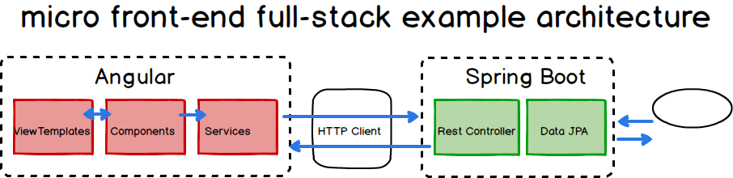
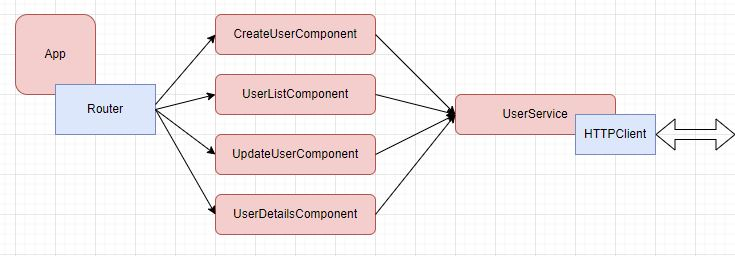

# mfe-rest-api 
## Spring Boot API for micro frontend examples (mfe)

This is a REST API for my mfe examples.

Download, build and run, and test with:

http://localhost:8080/hello

## Step 3 - Create Spring Boot Project and Configure MySQL
Lets add Spring Web, Spring Boot DevTools, 

### Adding MySQL Dependencies
Spring Data JPA, MySQL Driver.

    <dependency>
        <groupId>org.springframework.boot</groupId>
        <artifactId>spring-boot-starter-data-jpa</artifactId>
    </dependency>
    <dependency>
        <groupId>mysql</groupId>
        <artifactId>mysql-connector-java</artifactId>
        <version>8.0.32</version>
    </dependency>

### Configure MySQL Using Spring Boot Properties
CREATE DATABASE people_management_system

CREATE DATABASE employee_management_system

CREATE USER ‘local_user’@’localhost’ IDENTIFIED BY ‘password’;

CREATE USER 'springuser'@'%' identified by 'ThePassword'; -- Creates a user

GRANT ALL on employee_management_system.* to 'springuser'@'%'; -- Gives all privileges to the new user on the newly created database

SELECT * FROM mysql.user;

-----------------------------------------------------------

http://localhost:8080/demo/add -d firstName=Karthik -d lastName=Gokey -d emailId=michael.mohan@outlook.com

INSERT INTO employee (first_name, last_name, email_id) VALUES ('Sunny', 'Mohan', 'sunny.mohan@outlook.com');

SELECT * FROM employee;

ALTER TABLE employee MODIFY COLUMN id int NOT NULL AUTO_INCREMENT;

-----------------------------------------------------------

## Step 4 - Creating JPA Entity + Repository
To save data in the database using the Spring JPA, we need to create an entity model. Let’s create a User entity which will store the data in the database

Look for the entity model

### Create User Repository
This is an interface and we extending the JpaRepository. Spring will automatically create a bean for this entry 
(bean name as userRepository) and provide implementations for the CURD operations.The next step is to create a simple 
spring mvc controller and call the userRepositry to save information in the database.

### User Controller

## Step 5 - Creating User Employee REST API

## Step 6 - Creating Angular App using Angular CLI

## Step 7 - Setting Up Project Structure

## Step 8 - Basic Angular App Components

## Step  9 - Add Bootstrap