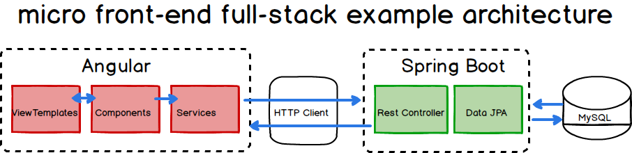

# mfe-rest-api 
## Spring Boot API for micro frontend examples (mfe)

This is a REST API for my mfe examples.

Here are the five basic REST APIs (Controller handler methods), I want to build for my Employee sample.

| Verb Rule |     API Name    | HTTP Method |          Path          |    Status Code   |           Description           |
|:---------:|:---------------:|:-----------:|:----------------------:|:----------------:|:-------------------------------:|
|     1     | GET Employees   | GET         | /api/vi/employees      | 200 (Ok)         | All employee resources returned |
|     2     | POST Employee   | POST        | /api/vi/employees      | 201 (Created)    | New employee resource created   |
|     3     | GET Employee    | GET         | /api/vi/employees/{id} | 200 (Ok)         | A specfic resource returned     |
|     4     | PUT Employee    | PUT         | /api/vi/employees/{id} | 200 (Ok)         | A specfic resource updated      |
|     5     | DELETE Employee | DELETE      | /api/vi/employees/{id} | 204 (No Content) | A specfic resource deleted      |

or as a visual, in case the table doesn't show up well for you. 

----------

Download, build and run, and test with:

http://localhost:8080/hello

## Step 3 - Create Spring Boot Project and Configure MySQL
Lets add Spring Web, Spring Boot DevTools, 

### Adding MySQL Dependencies
Spring Data JPA, MySQL Driver.

    <dependency>
        <groupId>org.springframework.boot</groupId>
        <artifactId>spring-boot-starter-data-jpa</artifactId>
    </dependency>
    <dependency>
        <groupId>mysql</groupId>
        <artifactId>mysql-connector-java</artifactId>
        <version>8.0.32</version>
    </dependency>

### Configure MySQL Using Spring Boot Properties
CREATE DATABASE people_management_system

CREATE DATABASE employee_management_system

CREATE USER ‘local_user’@’localhost’ IDENTIFIED BY ‘password’;

CREATE USER 'springuser'@'%' identified by 'ThePassword'; -- Creates a user

GRANT ALL on employee_management_system.* to 'springuser'@'%'; -- Gives all privileges to the new user on the newly created database

SELECT * FROM mysql.user;

-----------------------------------------------------------

http://localhost:8080/demo/add -d firstName=Karthik -d lastName=Gokey -d emailId=michael.mohan@outlook.com

INSERT INTO employee (first_name, last_name, email_id) VALUES ('Sunny', 'Mohan', 'sunny.mohan@outlook.com');

ALTER TABLE employee MODIFY COLUMN id int NOT NULL AUTO_INCREMENT;

SELECT * FROM employee;

http://localhost:8080/demo/all

INSERT INTO employee (first_name, last_name, email_id) VALUES ('Michael', 'Gokey', 'michael-gokey-architect@outlook.com');

-----------------------------------------------------------

## Step 4 - Creating JPA Entity + Repository
To save data in the database using the Spring JPA, we need to create an entity model. Let’s create a User entity which will store the data in the database

Look for the entity model

### Create User Repository
This is an interface and we extending the JpaRepository. Spring will automatically create a bean for this entry 
(bean name as userRepository) and provide implementations for the CURD operations.The next step is to create a simple 
spring mvc controller and call the userRepositry to save information in the database.

### User Controller

## Step 5 - Creating User Employee REST API
Add content later

## Step 6 - Creating Angular App using Angular CLI
Add content later

## Step 7 - Setting Up Project Structure
Add content later

## Step 8 - Basic Angular App Components
Add content later

## Step  9 - Add Bootstrap
Add content later

----------

https://spring.io/guides/gs/accessing-data-mysql/

https://spring.io/guides/gs/rest-service/

https://www.springboottutorial.com/spring-boot-crud-rest-service-with-jpa-hibernate

https://www.bezkoder.com/spring-boot-jpa-crud-rest-api/

https://www.bezkoder.com/deploy-spring-boot-aws-eb/

https://www.bezkoder.com/spring-boot-angular-15-crud/

https://www.bezkoder.com/angular-15-spring-boot-jwt-auth/

https://www.javaguides.net/2021/08/angular-12-spring-boot-crud-example.html

https://www.javaguides.net/2019/06/spring-boot-crudrepository-example-tutorial.html

## Documenting a Spring REST API Using OpenAPI 3.0
Last modified: January 30, 2023

https://www.baeldung.com/spring-rest-openapi-documentation

https://springdoc.org/#Introduction

https://www.theserverside.com/blog/Coffee-Talk-Java-News-Stories-and-Opinions/An-example-hibernatecfgxml-for-MySQL-8-and-Hibernate-5

